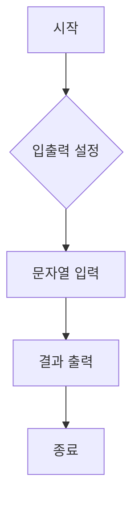

```mermaid
flowchart TD
    A[시작] --> B{입출력 설정};
    B --> C[문자열 입력];
    C --> D[결과 출력];
    D --> E[종료];
```

### 시간 복잡도

*   **O(L)**
*   입력 문자열의 길이를 L이라고 할 때, 문자열을 입력받고 출력하는 연산은 문자열의 길이에 비례합니다. 따라서 시간 복잡도는 O(L)입니다.

### 공간 복잡도

*   **O(L)**
*   입력 문자열 `s`를 저장하기 위한 공간이 문자열의 길이에 비례합니다. 따라서 공간 복잡도는 O(L)입니다.