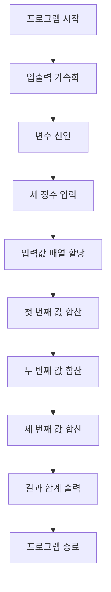

### 시간 복잡도

*   **O(1)** (상수 시간):
    이 코드는 입력으로 3개의 정수를 받고, 이들을 배열에 저장한 후 3번의 덧셈 연산을 통해 총합을 계산하고 출력합니다. 프로그램의 모든 주요 연산(입력, 할당, 덧셈, 출력)이 데이터의 크기나 개수와 무관하게 항상 고정된 횟수(예: 3회)로 수행됩니다. 따라서 시간 복잡도는 상수 시간인 O(1)입니다.

### 공간 복잡도

*   **O(1)** (상수 공간):
    이 코드는 `a`, `b`, `c`, `result` 변수와 크기가 3인 `num` 배열을 사용합니다. 이 변수들과 배열이 사용하는 메모리 공간의 크기는 입력되는 값의 크기나 개수에 따라 변하지 않고 항상 일정합니다. 따라서 공간 복잡도는 상수 공간인 O(1)입니다.