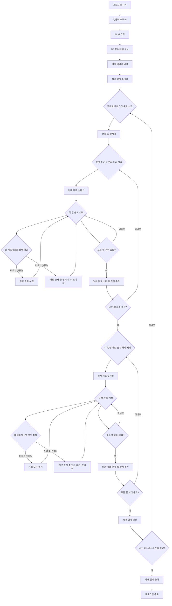

### 2. 시간 복잡도와 공간 복잡도

*   **시간 복잡도**: `O(N*M * 2^(N*M))`
    *   이 알고리즘은 `N*M` 크기의 격자에 대해 모든 가능한 분할 방식(가로/세로)을 비트마스크를 이용하여 탐색합니다. 격자의 셀 개수를 `K = N*M`이라 할 때, `2^K`개의 모든 비트마스크를 순회합니다.
    *   각 비트마스크마다, 격자를 두 번 (`N*M` 가로 순회, `M*N` 세로 순회) 탐색하여 숫자를 형성하고 합계를 계산합니다. 이 과정은 `O(N*M)` 시간이 소요됩니다.
    *   따라서 전체 시간 복잡도는 `O(N*M * 2^(N*M))`이 됩니다.

*   **공간 복잡도**: `O(N*M)`
    *   입력 격자의 숫자들을 저장하기 위한 `v` 2차원 벡터가 `N*M` 크기의 정수 데이터를 저장합니다. 이는 `O(N*M)` 공간을 차지합니다.
    *   그 외의 변수들(예: `n, m, max_sum, total_sum, row_sum, col_sum` 등)은 격자 크기와 무관하게 상수 `O(1)` 공간을 사용합니다.
    *   따라서 전체 공간 복잡도는 `O(N*M)` 입니다.