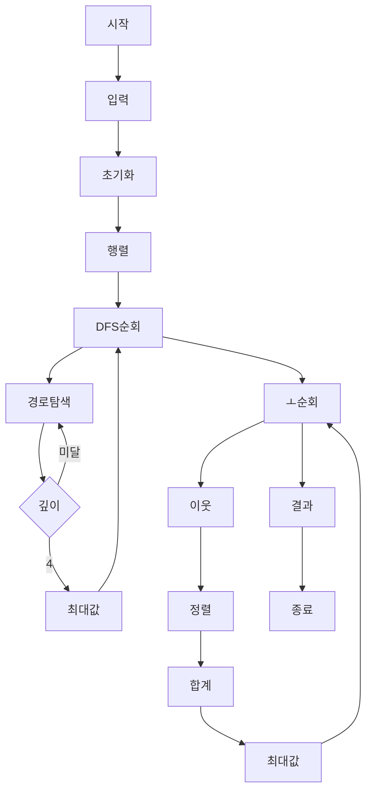

**시간 복잡도:**
이 알고리즘은 크게 두 부분으로 나뉩니다.
1.  `calc1` 함수를 이용한 DFS 기반 탐색: `N x M` 크기의 모든 격자 칸을 시작점으로 하여, 최대 깊이 4인 경로를 탐색합니다. 각 시작점에서의 탐색은 상수에 가까운 시간을 소요하므로, 이 부분의 시간 복잡도는 `O(N * M)`입니다.
2.  'ㅗ' 모양 탐색: `N x M` 크기의 모든 격자 칸을 중심으로 하여 주변 이웃들을 확인하고 정렬하여 합을 계산합니다. 각 칸에서의 계산은 상수에 가까운 시간을 소요하므로, 이 부분의 시간 복잡도 역시 `O(N * M)`입니다.
따라서 전체 시간 복잡도는 `O(N * M)`입니다.

**공간 복잡도:**
`N x M` 크기의 격자 값(`v`)과 방문 여부(`visited`)를 저장하는 데 `O(N * M)`의 공간이 필요합니다.
`calc1` 함수의 재귀 호출 스택 깊이는 최대 4이므로 `O(1)` 공간을 사용합니다.
'ㅗ' 모양 탐색에서 `neighbors` 벡터는 최대 4개의 요소를 저장하므로 `O(1)` 공간을 사용합니다.
따라서 전체 공간 복잡도는 `O(N * M)`입니다.