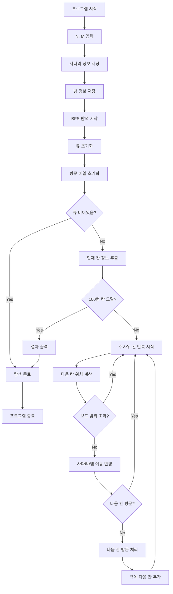

### 시간 복잡도

제공된 코드는 너비 우선 탐색(BFS)을 사용하여 보드 게임의 최단 경로를 찾습니다. 보드의 칸 수는 1부터 100까지 고정되어 있으며, 이는 100개의 노드를 가진 그래프로 볼 수 있습니다. 각 칸에서 주사위를 굴리면 최대 6개의 다음 칸으로 이동할 수 있으므로, 간선의 수는 최대 `100 * 6`개입니다.

BFS는 각 노드와 간선을 최대 한 번씩 방문하므로, 시간 복잡도는 일반적으로 O(V + E)입니다 (V: 노드 수, E: 간선 수). 이 문제에서는 V=100, E=600으로 모두 상수 값입니다. `map` 조회는 최악의 경우 O(log K)이지만, 사다리 및 뱀의 개수(K)가 최대 15로 매우 작아 상수 시간에 가깝습니다.

따라서 전체 시간 복잡도는 **O(1)** 입니다. (만약 보드의 크기가 N으로 가변적이었다면 O(N)이 됩니다.)

### 공간 복잡도

코드는 다음 데이터 구조들을 사용합니다:
*   `queue`: 최악의 경우 보드의 모든 칸(100개)을 저장할 수 있습니다.
*   `visited` 배열: 101개의 `bool` 값을 저장합니다.
*   `ladder` map: 최대 `n`개의 사다리 정보를 저장합니다 (`n <= 15`).
*   `snake` map: 최대 `m`개의 뱀 정보를 저장합니다 (`m <= 15`).

이 모든 데이터 구조의 크기가 문제에서 주어진 상수(100, 15)로 제한됩니다.

따라서 전체 공간 복잡도는 **O(1)** 입니다. (만약 보드의 크기가 N으로 가변적이었다면 O(N)이 됩니다.)