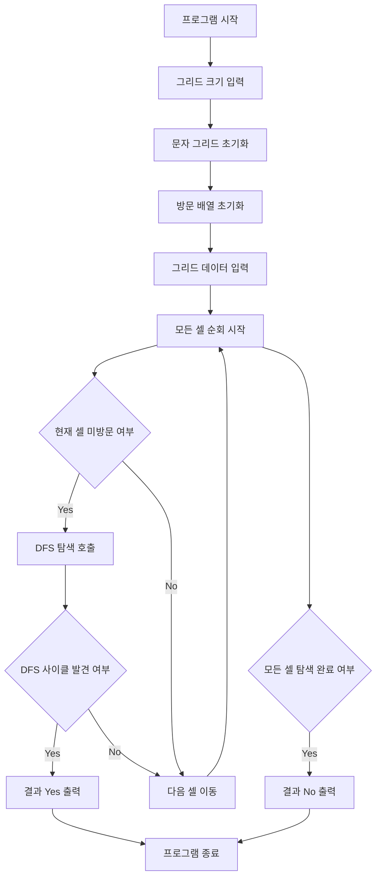

### 시간 복잡도

*   **O(N * M)**
*   알고리즘은 그래프의 모든 정점(셀)과 간선(인접한 동일 문자 셀)을 최대 한 번씩 탐색합니다. N x M 크기의 그리드에서 정점의 개수는 N * M이고, 각 정점은 최대 4개의 간선을 가질 수 있습니다. 따라서 DFS 탐색에 필요한 시간은 O(정점 수 + 간선 수)이며, 이는 O(N * M + 4 * N * M)으로 간단히 O(N * M)이 됩니다.

### 공간 복잡도

*   **O(N * M)**
*   `two_dots` 그리드에 N * M개의 문자를 저장합니다.
*   `visited` 배열에 N * M개의 불리언 값을 저장합니다.
*   DFS 재귀 호출 스택의 깊이가 최악의 경우 N * M에 비례할 수 있습니다(예: 모든 셀을 한 줄로 연결하는 경로).
*   따라서 전체 공간 복잡도는 O(N * M)입니다.