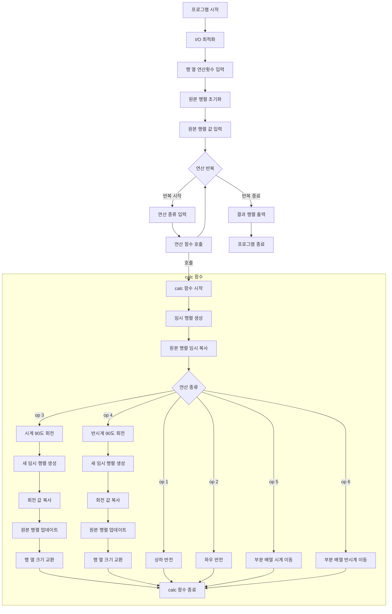

1.  **알고리즘 핵심 로직 흐름 분석 및 시각화**

2.  **시간 복잡도와 공간 복잡도**

*   **시간 복잡도**: `O(R * N * M)`
    *   초기 `N x M` 크기의 행렬을 입력받는 데 `O(N*M)` 시간이 소요됩니다.
    *   총 `R`번의 연산(`calc` 함수 호출)이 수행됩니다.
    *   `calc` 함수 내부에서 행렬을 복사하거나 각 연산(상하 반전, 좌우 반전, 회전, 부분 배열 이동)을 수행할 때, 모든 요소에 접근하거나 새로운 행렬을 생성하여 복사하는 작업이 발생합니다. 이 모든 작업은 현재 행렬의 크기(`N*M`)에 비례합니다.
    *   따라서 한 번의 연산에 `O(N*M)` 시간이 소요되며, 총 `R`번 반복되므로 전체 시간 복잡도는 `O(R * N * M)`이 됩니다. `N`과 `M`은 연산 3, 4에 의해 서로 바뀔 수 있지만, `N*M`의 총 원소 개수는 동일합니다.

*   **공간 복잡도**: `O(N * M)`
    *   원본 행렬 `a`를 저장하는 데 `O(N*M)` 공간이 필요합니다.
    *   `calc` 함수 내에서 각 연산을 수행하기 위해 `temp` 행렬(`N x M`) 또는 `trans_temp` 행렬(`M x N`)과 같은 임시 행렬을 생성합니다. 이 임시 행렬들은 모두 `O(N*M)` 크기를 가집니다.
    *   따라서 추가적으로 필요한 최대 공간은 `O(N*M)`이며, 전체 공간 복잡도는 `O(N*M)`이 됩니다.