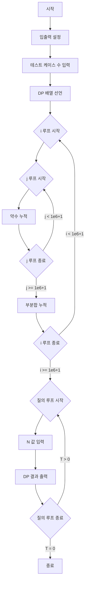

### 시간 복잡도

**O(MAX log MAX + T)**

*   **MAX**: `dp` 배열의 최대 크기 (여기서는 10^6).
*   **log MAX**: 자연로그(ln)에 비례하는 값으로, 조화급수의 합 (1 + 1/2 + 1/3 + ... + 1/MAX) 때문에 발생합니다.
*   **T**: 테스트 케이스의 수.

1.  **전처리 단계 (DP 배열 계산):**
    *   첫 번째 중첩 반복문 `for (int i = 1; ...)`과 `for (int j = i; ...)`에서 `i`는 1부터 `MAX`까지 반복하며, 각 `i`에 대해 `j`는 `i`의 배수들을 순회합니다. 이 과정의 총 연산 수는 `MAX/1 + MAX/2 + MAX/3 + ... + MAX/MAX`와 같습니다. 이는 `MAX` 곱하기 `MAX`번째 조화수(H_MAX)에 해당하며, `H_MAX`는 약 `ln(MAX)`에 비례합니다.
    *   따라서 `O(MAX log MAX)`의 시간이 소요됩니다. (예: `10^6 * ln(10^6) ≈ 10^6 * 13.8` 연산)
2.  **질의 처리 단계:**
    *   각 테스트 케이스 `n`에 대해 `dp[n]` 값을 출력하는 것은 배열에서 직접 값을 찾아오는 `O(1)` 연산입니다.
    *   총 `T`개의 테스트 케이스가 있으므로 `O(T)`의 시간이 소요됩니다.

### 공간 복잡도

**O(MAX)**

*   `vector<long long> dp(1e6 + 1, 0);` 선언으로 인해 `MAX + 1` 크기의 `long long` 타입 배열이 사용됩니다.
*   `MAX` 값에 비례하여 공간이 증가하므로 `O(MAX)`의 공간 복잡도를 가집니다. (예: `10^6`개의 `long long`은 약 `8MB`의 메모리를 사용합니다.)