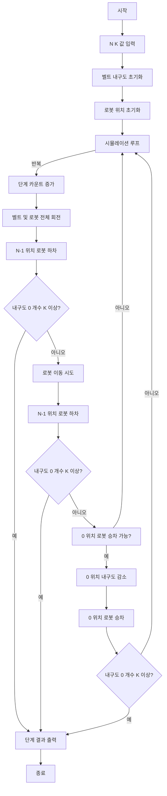

### 시간 복잡도

*   **O(M * N)**
    *   `N`은 벨트 한 줄의 길이이며, 전체 벨트 길이는 `2N`입니다.
    *   `M`은 `a_cnt`가 `k`에 도달할 때까지의 시뮬레이션 단계 수입니다.
    *   각 시뮬레이션 단계에서는 `rotate` 함수와 `move` 함수가 호출됩니다.
        *   `rotate` 함수는 `2N`개 요소를 순회하며 회전시키므로 O(N) 시간이 소요됩니다.
        *   `move` 함수는 `N`개 요소를 순회하며 로봇 이동을 처리하므로 O(N) 시간이 소요됩니다.
    *   따라서 한 단계의 총 시간 복잡도는 O(N)이며, `M` 단계가 반복되므로 전체 시간 복잡도는 O(M * N)이 됩니다.

### 공간 복잡도

*   **O(N)**
    *   `a` 벡터는 벨트 내구도를 저장하며 `2N` 크기를 가집니다.
    *   `robots` 벡터는 로봇의 존재 여부를 저장하며 `2N` 크기를 가집니다.
    *   이 두 벡터가 프로그램이 사용하는 주된 메모리이며, `N`에 비례하는 공간을 사용합니다.
    *   따라서 공간 복잡도는 O(N)입니다.