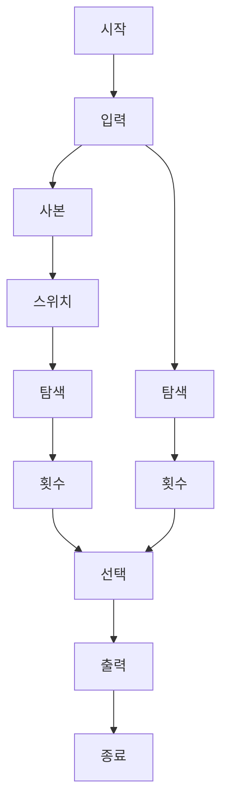

### 시간 복잡도

*   **O(N^2)**
    *   `find` 함수 내부의 `for` 루프는 `N-1`번 실행됩니다. 이 루프 내에서 `current == answer` 문자열 비교가 발생할 수 있습니다. `std::string` 비교는 최악의 경우 문자열의 길이에 비례하는 `O(N)` 시간을 소요합니다. 따라서 `N`번의 `O(N)` 비교가 발생하여 총 시간 복잡도는 `O(N^2)`가 됩니다.

### 공간 복잡도

*   **O(N)**
    *   입력받은 두 문자열 `current`와 `answer` (길이 `N`)를 저장하는 데 `O(N)` 공간이 필요합니다. `current`를 복사한 `exp` 문자열 또한 `O(N)` 공간을 사용합니다. 다른 변수들은 상수 공간을 사용합니다.