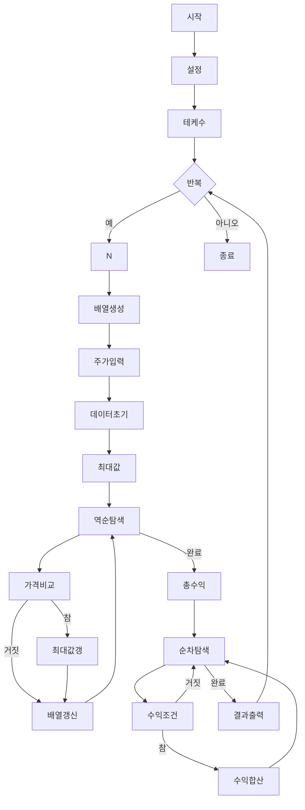

### 시간 복잡도
*   **O(T * N)**
    *   `T`는 테스트 케이스의 수이고, `N`은 각 테스트 케이스의 주식 가격 수입니다.
    *   각 테스트 케이스 내에서 주식 가격 입력, 최대값 갱신, 총 수익 계산 과정이 각각 `N`에 비례하는 선형 시간을 소비합니다.
    *   따라서 전체 시간 복잡도는 `T`에 `N`을 곱한 값에 비례합니다.

### 공간 복잡도
*   **O(N)**
    *   각 테스트 케이스마다 `N`개의 `pair<int, int>`를 저장하는 `stock` 벡터를 사용합니다.
    *   `stock` 벡터가 `N`개의 데이터를 저장하므로, `N`에 비례하는 공간을 사용합니다.