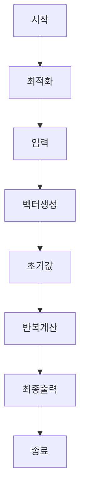

```mermaid
flowchart TD
    A[시작] --> B[최적화]
    B --> C[입력]
    C --> D[벡터생성]
    D --> E[초기값]
    E --> F[반복계산]
    F --> G[최종출력]
    G --> H[종료]
```

### 시간 복잡도
O(N)
입력 `n`에 비례하여 벡터를 초기화하고, `n-2`번의 반복문을 통해 각 값을 계산하므로 선형 시간에 비례합니다.

### 공간 복잡도
O(N)
`n` 크기의 `vector<long long>` 배열을 사용하여 계산 결과를 저장하므로, `n`에 비례하는 공간을 사용합니다.