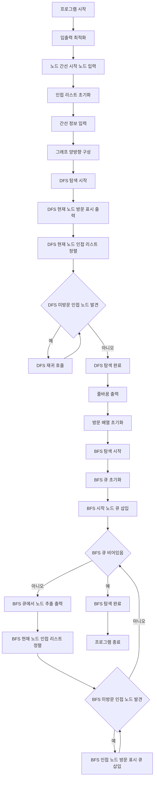

### 시간 복잡도

*   **그래프 초기화**: 노드 `N`개와 간선 `M`개를 위한 인접 리스트를 생성하고 간선 정보를 입력하는 데 `O(N + M)` 시간이 소요됩니다.
*   **DFS 및 BFS 탐색**:
    *   각 정점과 간선을 한 번씩 방문하므로 기본적인 탐색에 `O(N + M)` 시간이 소요됩니다.
    *   탐색 과정에서 각 노드의 인접 리스트를 정렬하는 작업이 추가됩니다. 노드 `u`의 인접 리스트 정렬에 `O(deg(u) log(deg(u)))` 시간이 소요되며, 모든 노드에 대한 정렬 시간을 합하면 총 `O(M log N)` 시간이 소요됩니다. (여기서 `deg(u)`는 노드 `u`의 차수입니다.)
*   **방문 배열 초기화**: DFS 후에 BFS를 위해 `visited` 배열을 초기화하는 데 `O(N)` 시간이 소요됩니다.

따라서 전체 시간 복잡도는 `O(N + M + M log N)`이며, 일반적으로 `O(N + M log N)`으로 표현됩니다. (여기서 `N`은 정점의 수, `M`은 간선의 수입니다.)

### 공간 복잡도

*   **인접 리스트 (`vec`)**: 그래프의 모든 노드와 간선 정보를 저장하기 위해 `O(N + M)` 공간이 필요합니다. (양방향 그래프이므로 각 간선이 두 번 저장됩니다.)
*   **`visited` 배열**: `N`개의 노드 방문 상태를 저장하기 위해 `O(N)` 공간이 필요합니다.
*   **DFS 재귀 스택**: 최악의 경우 (경로 그래프) 탐색 깊이가 `N`이 되어 `O(N)` 공간이 필요합니다.
*   **BFS 큐**: 최악의 경우 (너비가 넓은 그래프) 큐에 `N`개의 노드가 저장되어 `O(N)` 공간이 필요합니다.

따라서 전체 공간 복잡도는 `O(N + M)`입니다.