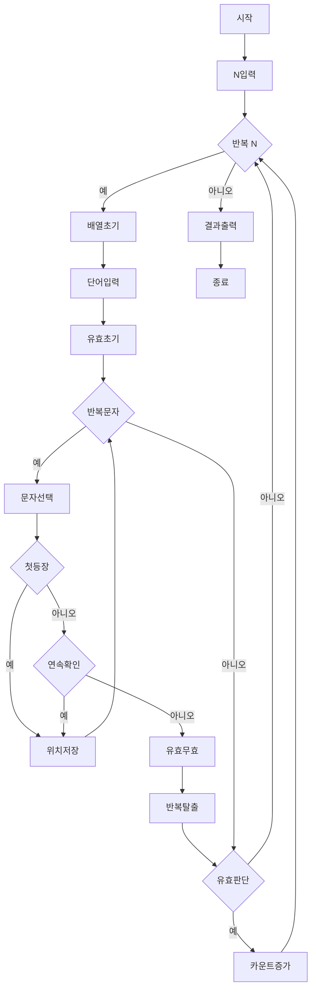

### 시간 복잡도

주어진 N개의 문자열 각각에 대해, 문자열의 길이에 비례하는 연산을 수행합니다. 각 문자열의 최대 길이를 L이라고 할 때, 전체 시간 복잡도는 O(N * L)입니다.

### 공간 복잡도

알파벳의 출현 여부 및 위치를 저장하기 위한 26 크기의 배열과 현재 처리 중인 문자열을 저장하는 공간만 필요합니다. 알파벳 배열은 상수 공간(O(1))을 차지하며, 문자열의 최대 길이를 L이라고 할 때, 문자열 저장 공간은 O(L)입니다. 따라서 전체 공간 복잡도는 O(L)입니다.