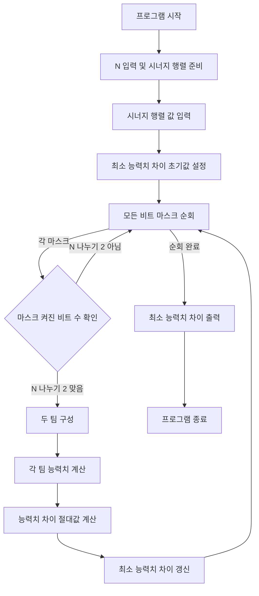

### 시간 복잡도

*   **O(2^N \* N^2)**
    *   `N`명의 플레이어를 두 팀으로 나누는 모든 가능한 조합을 비트 마스크를 이용해 탐색합니다. 이 조합의 수는 `2^N`입니다.
    *   각 조합에 대해, `N/2`명의 팀원을 구성하는 데 `O(N)`의 시간이 소요됩니다.
    *   두 팀 각각의 능력치를 계산하는 `calc_stat` 함수는 `N/2`명의 팀원에 대해 모든 쌍을 검사하므로 `O((N/2)^2)` 즉 `O(N^2)`의 시간이 소요됩니다.
    *   따라서 전체 시간 복잡도는 `2^N` (조합 수) \* `(N` (팀 구성) + `N^2` (능력치 계산))`로, 최종적으로 **O(2^N \* N^2)**가 됩니다.

### 공간 복잡도

*   **O(N^2)**
    *   `s` 행렬은 `N x N` 크기의 데이터를 저장하므로 `O(N^2)`의 공간을 사용합니다.
    *   각 팀의 플레이어 인덱스를 저장하는 `start_team`과 `link_team` 벡터는 각각 `N/2`개의 요소를 저장하므로 `O(N)`의 공간을 사용합니다.
    *   이 외의 변수들은 상수 공간 `O(1)`을 사용합니다.
    *   따라서 전체 공간 복잡도는 `O(N^2)`에 의해 지배되므로 **O(N^2)**가 됩니다.