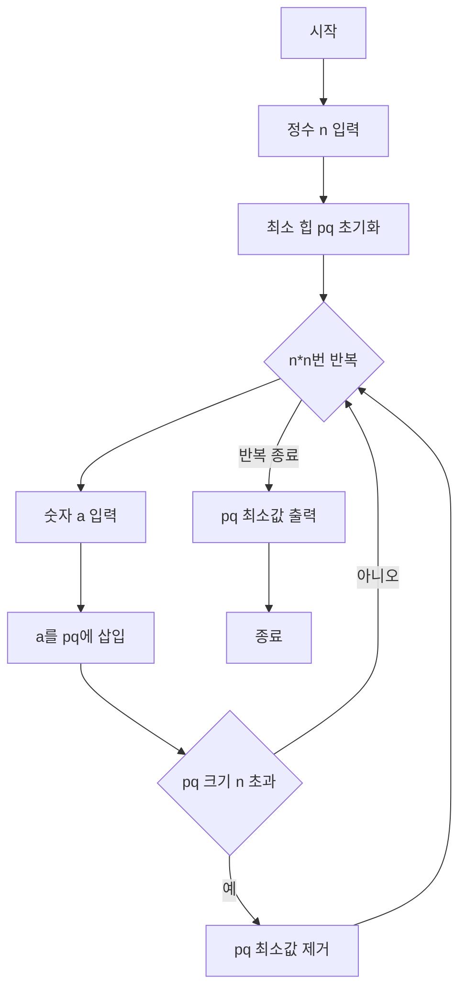

### 시간 복잡도

**O(n^2 log n)**

주어진 코드는 `n*n`번 반복되는 루프를 가지고 있습니다. 루프 내부에서는 `priority_queue`에 요소를 삽입(`push`)하거나 제거(`pop`)하는 연산이 수행됩니다. `priority_queue`의 크기는 최대 `n`개를 유지하므로, `push`와 `pop` 연산은 각각 O(log n)의 시간 복잡도를 가집니다. 따라서 전체 루프의 시간 복잡도는 `n*n * O(log n)`이 되어 O(n^2 log n)입니다.

### 공간 복잡도

**O(n)**

`priority_queue`는 최대 `n`개의 정수를 저장합니다. 다른 변수들은 상수 공간을 차지합니다. 따라서 `priority_queue`가 사용하는 공간이 지배적이므로, 전체 공간 복잡도는 O(n)입니다.