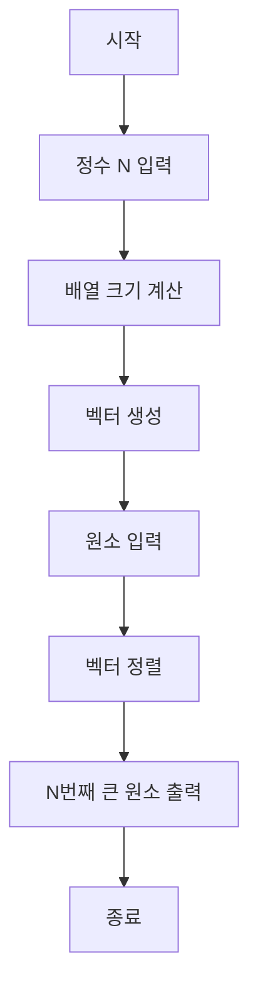

1. 전체 알고리즘 핵심 로직 흐름 (Mermaid.js flowchart TD)

2. 시간 복잡도와 공간 복잡도

*   **시간 복잡도:** O(N^2 log N)
    *   `N` 값을 입력받고, `N*N` 크기의 벡터를 생성하여 `N*N`개의 정수를 입력받는 과정은 O(N^2) 시간이 소요됩니다.
    *   핵심은 `std::sort` 함수로, `N*N`개의 요소를 정렬하는 데 O(M log M) 시간이 걸립니다. 여기서 `M = N*N`이므로 O(N^2 log(N^2)) = O(N^2 log N)이 됩니다.
    *   정렬된 벡터에서 특정 요소를 출력하는 것은 O(1)입니다.
    *   따라서 전체 시간 복잡도는 정렬 과정에 의해 지배되어 O(N^2 log N)입니다.

*   **공간 복잡도:** O(N^2)
    *   `N*N`개의 정수를 저장하는 `v` 벡터가 주요 공간을 차지합니다.
    *   `N*N` 크기의 벡터는 O(N^2) 공간을 사용합니다.
    *   나머지 변수들은 O(1) 공간을 사용하므로, 전체 공간 복잡도는 O(N^2)입니다.