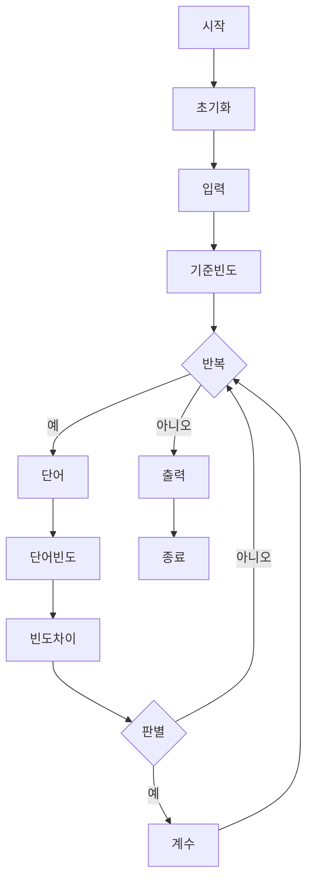

**시간 복잡도**:
단어의 개수 N과 각 단어의 최대 길이 L에 비례합니다. 기준 단어 빈도 계산에 O(L), 이후 (N-1)개의 단어 각각에 대해 단어 읽기 O(L), 빈도 계산 O(L), 빈도 차이 비교 O(1)가 소요되므로, 총 시간 복잡도는 O(N * L)입니다.

**공간 복잡도**:
알파벳 빈도를 저장하는 크기 26의 배열 두 개만 사용합니다. 이들은 입력 크기에 상관없이 고정된 크기이므로, 공간 복잡도는 O(1)입니다.