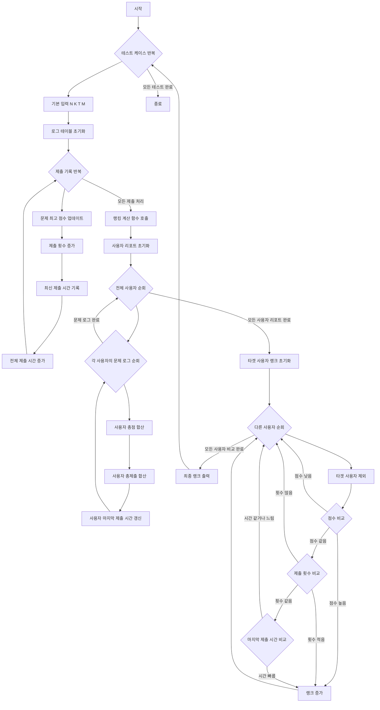

### 2. 시간 복잡도와 공간 복잡도

*   **시간 복잡도**: `O(T * (N * K + M))`
    *   `T`: 테스트 케이스의 수
    *   `N`: 사용자의 수
    *   `K`: 문제의 수
    *   `M`: 전체 제출 기록의 수
    *   각 테스트 케이스 내에서, `M`개의 제출 기록을 처리하는 데 `O(M)` 시간이 소요됩니다.
    *   이후 `calc` 함수에서는 `N`명의 사용자에 대해 `K`개의 문제 로그를 순회하며 리포트를 계산하는 데 `O(N * K)` 시간이 소요됩니다.
    *   마지막으로 `N`명의 다른 사용자와 타겟 사용자의 순위를 비교하는 데 `O(N)` 시간이 소요됩니다.
    *   따라서 각 테스트 케이스당 총 시간 복잡도는 `O(M + N * K + N)`이며, 이는 `O(N * K + M)`으로 단순화될 수 있습니다.
    *   전체 시간 복잡도는 테스트 케이스 수 `T`를 곱하여 `O(T * (N * K + M))`이 됩니다.

*   **공간 복잡도**: `O(N * K)`
    *   `N`: 사용자의 수
    *   `K`: 문제의 수
    *   `table` 벡터는 `(N + 1) * (K + 1)` 크기의 `Log` 구조체를 저장하므로 `O(N * K)`의 공간을 사용합니다.
    *   `report` 벡터는 `(N + 1)` 크기의 `Report` 구조체를 저장하므로 `O(N)`의 공간을 사용합니다.
    *   지배적인 항은 `O(N * K)`이므로, 전체 공간 복잡도는 `O(N * K)`입니다.