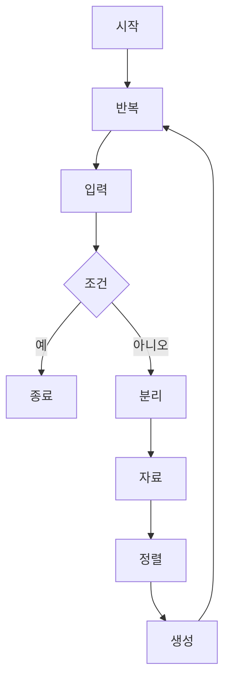

**시간 복잡도:**
O(N^6)
N개의 숫자 중 6개의 조합을 생성하고 출력하는 과정에서, 재귀 호출의 수는 N에 대한 6차 다항식(N^6)에 비례합니다. 초기 정렬은 O(N log N)이지만, 조합 생성 및 출력이 훨씬 지배적입니다.

**공간 복잡도:**
O(N)
`nums` 벡터에 N개의 숫자를 저장하며 O(N) 공간을 사용합니다. 재귀 호출 스택의 깊이도 최대 N이므로 O(N) 공간을 사용합니다. `selected` 벡터는 항상 6개의 원소만 저장하므로 O(1)입니다.