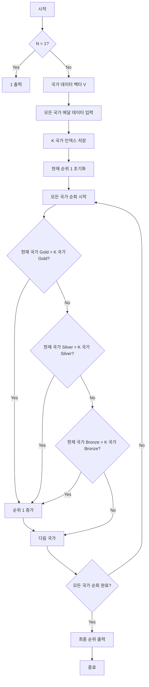

### 시간 복잡도

*   **O(N)**
*   국가 수 `N`에 비례하는 두 번의 반복문이 주를 이룹니다. 첫 번째 반복문은 `N`개의 국가 데이터를 입력받고 K 국가의 인덱스를 찾는 데 O(N) 시간이 소요됩니다. 두 번째 반복문은 `N`개의 모든 국가를 순회하며 K 국가와 메달 수를 비교하는 데 O(N) 시간이 소요됩니다. 따라서 전체 시간 복잡도는 O(N)입니다.

### 공간 복잡도

*   **O(N)**
*   `N`개의 국가 각각에 대해 4개의 정수(`v[i][0]` ~ `v[i][3]`)를 저장하는 `vector<vector<int>> v`를 사용합니다. 이 자료구조의 크기는 `N`에 비례하므로 O(N)의 공간이 필요합니다.